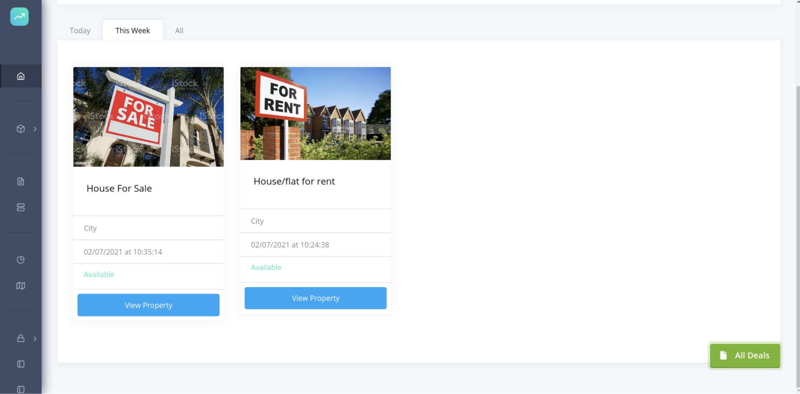
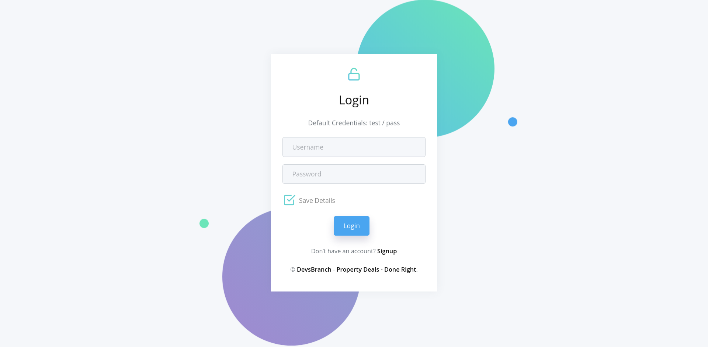

# Property Deals 
The purpose of this application is to provide a platform  where 
people can post properties for sale or rent e.g Houses.



## Getting Started 🚀

These instructions will get you a copy of the project up and running on your local machine.

### Prerequisites 📋

You'll need [Git](https://git-scm.com) and [Python](https://www.python.org/downloads/) (which comes with `pip`) installed on your computer.

```
python@3.6.0 or higher
pip@20.0 or higher
git@2.20.0 or higher
```

---

## How To run application 🔧

From your command line, first clone property-deals:
### This command works on Linux and Mac and Windows

```bash
# Clone this repository
git clone https://github.com/devsbranch/property-deals.git

# Go into the repository
cd property-deals
```

Then you can install the dependencies using PIP:

### On Linux and Mac
```bash
# Install dependencies
$ pip3 install -r requirememts.txt

# Start development server
$ python3 run.py
```

### On Windows
Use Powershell, Command Prompt or Windows Terminal

```bash
# Install dependencies
PS> pip install -r requirememts.txt

# Start development server
PS> python run.py

```
Once your server has started, go to this url `http://localhost:5000/` and you will see the website running on a Development Server:



---

## Technologies used 🛠️
- [Flask](https://flask.palletsprojects.com/en/1.1.x/) - A Python Web Development Framework
- [SQLAlchemy](https://www.sqlalchemy.org)- The Python SQL Toolkit and Object Relational Mapper
- [Bootstrap 4](https://getbootstrap.com/docs/4.3/getting-started/introduction/) - Front-end component library

## Authors

- **Allison Mukoma** - [https://github.com/sonlinux](https://github.com/sonlinux)
- **Jachin Manda** - [https://github.com/Jachin-Manda](https://github.com/sonlinux)

## Status
Still under development
